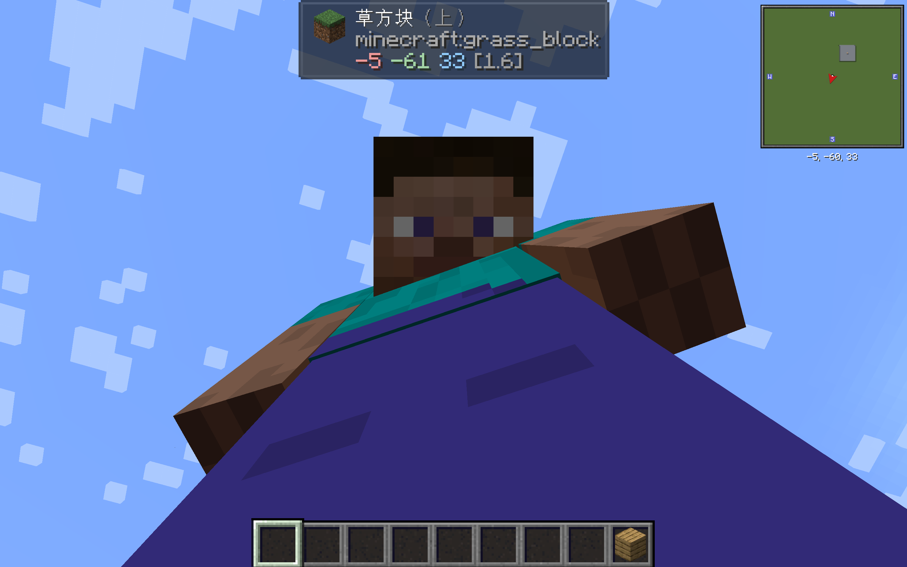
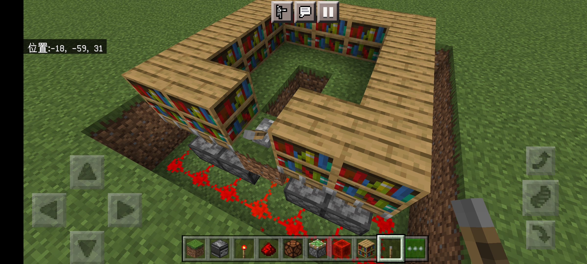
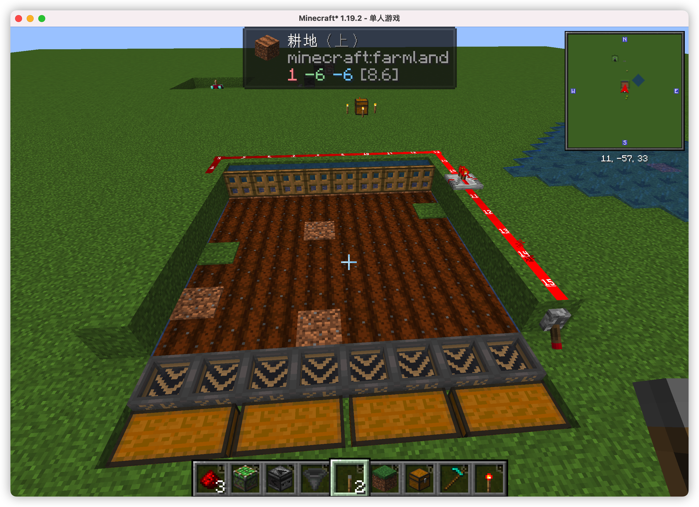
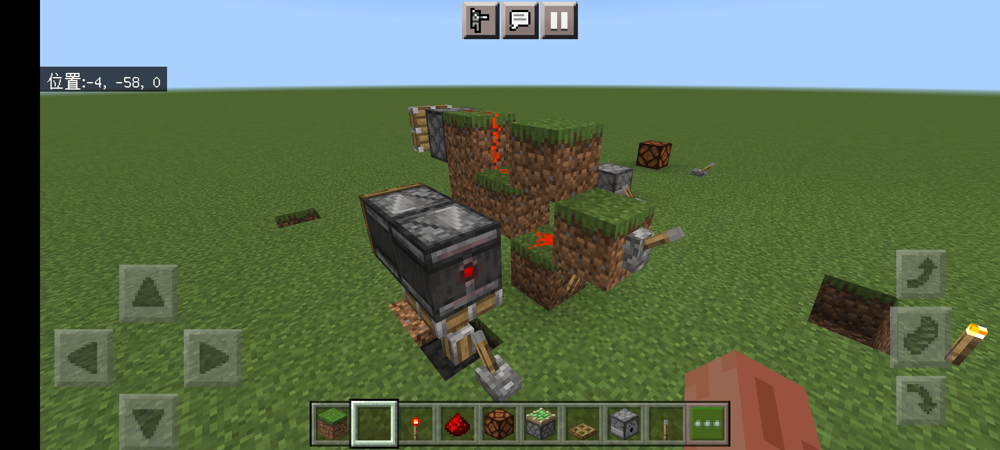

## 版本安装、联机

### jdk

- [Latest Releases | Adoptium](https://adoptium.net/zh-CN/temurin/releases/)
  - [Index of /Adoptium/ | 清华大学开源软件镜像站 | Tsinghua Open Source Mirror](https://mirrors.tuna.tsinghua.edu.cn/Adoptium/)
- [Java Downloads | Oracle](https://www.oracle.com/java/technologies/downloads/#jdk17-mac)
- [Azul Zulu](https://www.azul.com/downloads/?version=java-17-lts&os=macos&architecture=arm-64-bit&package=jdk-fx)

### 客户端

- BE - 基岩版 (手机版)
  - [Minecraft(我的世界)苦力怕论坛——我的世界基岩版，我的世界资源网，我的世界玩家论坛，我的世界下载站，我的世界手机版 -](https://klpbbs.com)
  - [《Minecraft: Bedrock Edition》创作者文档 | Microsoft Learn](https://learn.microsoft.com/zh-cn/minecraft/creator/)
- JE - Java 版 (需安装 jdk, mac m1 新手建议直接 x86 转译; 测试仅支持 1.19 以上版本)
  - HMCL (新手建议下载稳定版; m1 使用 arm jdk 指定 [lwjgl](https://www.lwjgl.org) 库路径即可; ==测试版已支持 arm jdk==)
    - [在 M1 Macbook 中使用原生 Java 运行 Minecraft – 云原生实验室 - Kubernetes|Docker|Istio|Envoy|Hugo|Golang|云原生](https://icloudnative.io/posts/minecraft-m1/)
  - HMCL-PE
    - 启动速度、流畅度待优化
    - 移动端操作性不如基岩版
  - MultiMC
    - PolyMC
      - ~~ManyMC~~

### 联机

- 局域网
- XBox
- [IMC联机](https://mcc.imc.re) 不行
- 内网穿透
  - [Free FRP 免费 FRP 内网穿透](https://freefrp.net)

        ```ini
        [common]
        server_addr = frp1.freefrp.net
        server_port = 7000
        token = freefrp.net
        
        [tcp]
        type = tcp
        local_ip = 127.0.0.1
        local_port = 25565
        remote_port = 35565
        use_encryption = false
        use_compression = false
        
        [udp]
        type = udp
        local_ip = 127.0.0.1
        local_port = 19132
        remote_port = 29132
        use_encryption = false
        use_compression = false
        ```

  - [Sakura Frp](https://www.natfrp.com/user/): 不支持 mac?
  - [StarryFrp](https://frp.starryfrp.com/console/index): 需要实名
  - [cpolar](https://www.cpolar.com/): 不支持 udp
    - `authtoken`
    - `tcp 25565`
  - ngrok
  - nps
  - ZeroTier
  - Tailscale
  - opengnb
- IPv6
  - 地址格式: `[ipv6]:port` 记得关路由器、系统防火墙

> Java 版可通过 Geyser (udp) 让基岩版联机 (但貌似会有不少问题)

### 服务器

[Download server for Minecraft | Minecraft](https://www.minecraft.net/zh-hans/download/server)  
[基岩版服务器下载 | Minecraft](https://www.minecraft.net/zh-hans/download/server/bedrock) 

- `java -Xmx1G -Xms1G -Xdock:name=mcserver -jar server.jar`
- 修改 eula.txt
- 修改 [server.properties](https://wiki.biligame.com/mc/Server.properties#server.properties)
  - Online-mode: false
- 用 `op` 指令设置管理员
- 调优 [MC服务端优化教程v2_2 - 蜘蛛丶博客论坛](https://www.spiderbbs.com/knowledge-base/minecraft/java-server/mc服务端优化教程v2_1/)
- [spigotmc](https://www.spigotmc.org)
  - [paper](https://papermc.io/)

### 模组、插件

[MC百科|最大的Minecraft中文MOD百科](https://www.mcmod.cn/)  
[curseforge](https://www.curseforge.com/minecraft/mc-mods)  
[mcpedl](https://mcpedl.com)  

> 注意: 有的是只需要客户端安装, 有的是服务端也需要安装!

- forge (建议新手)
  - OptiFine
  - I18nUpdateMod (暂不支持 1.19)
  - Inventory Sorter
- fabric (仅限高版本使用; 启动时 cpu 100%)
  - Sodium
  - Litematica 投影
- quilt
- multi
  - Xaero's Minimap、World Map
  - Jade
  - JEI
  - Inventory Profiles Next (依赖较多)
  - Mouse Tweaks
  - CustomSkinLoader
  - BBOR



### 皮肤、数据包、资源包

- [XeKr](https://www.bilibili.com/read/cv12954040?spm_id_from=333.999.0.0)

## 世界

- 主世界 Overworld
  - 海底
- 下界 The Nether: 黑曜石 4 \* 5, 打火石点燃
- 末地 The End: 站在一个位置依次往四个方向摆 3 个 end_portal_frame, 共计 12 个, 然后依次摆上 ender_eye 即可

### 种子

[种子地图](https://www.chunkbase.com/apps/seed-map): 可以在已生成的世界中寻找特定结构

### [生物群系](https://wiki.biligame.com/mc/生物群系)

### [结构](https://wiki.biligame.com/mc/生成结构#可被定位的结构)

| 结构名称   | Java版                  | 基岩版              | 所在维度 |
|--------|------------------------|------------------|------|
| 远古城市   | ancient_city           | ancientcity      | 主世界  |
|        |                        | ancient_city     |      |
| 埋藏的宝藏  | buried_treasure        | buriedtreasure   | 主世界  |
|        |                        | buried_treasure  |      |
| 末地城    | end_city               | endcity          | 末地   |
|        |                        | end_city         |      |
| 下界要塞   | fortress               | fortress         | 下界   |
| 林地府邸   | mansion                | mansion          | 主世界  |
| 废弃矿井   | mineshaft              | mineshaft        | 主世界  |
|        | mineshaft_mesa         |                  |      |
| 海底神殿   | monument               | monument         | 主世界  |
| 海底废墟   | ocean_ruin_cold        | ruins            | 主世界  |
|        | ocean_ruin_warm        |                  |      |
| 沉船     | shipwreck              | shipwreck        | 主世界  |
|        | shipwreck_beached      |                  |      |
| 要塞     | stronghold             | stronghold       | 主世界  |
| 沙漠神殿   | desert_pyramid         | temple           | 主世界  |
| 雪屋     | igloo                  |                  |      |
| 丛林神庙   | jungle_pyramid         |                  |      |
| 沼泽小屋   | swamp_hut              |                  |      |
| 村庄     | village_desert         | village          | 主世界  |
|        | village_plains         |                  |      |
|        | village_savanna        |                  |      |
|        | village_snowy          |                  |      |
|        | village_taiga          |                  |      |
| 掠夺者前哨站 | pillager_outpost       | pillageroutpost  | 主世界  |
|        |                        | pillager_outpost |      |
| 下界化石   | nether_fossil          | –                | 下界   |
| 堡垒遗迹   | bastion_remnant        | bastionremnant   | 下界   |
|        |                        | bastion_remnant  |      |
| 废弃传送门  | ruined_portal          | ruinedportal     | 主世界  |
|        | ruined_portal_desert   | ruined_portal    |      |
|        | ruined_portal_jungle   |                  |      |
|        | ruined_portal_mountain |                  |      |
|        | ruined_portal_ocean    |                  |      |
|        | ruined_portal_swamp    |                  |      |
|        | ruined_portal_nether   |                  | 下界   |

*结构方块*

### BOSS

- 末影龙
- 凋灵

### 命令 (作弊)

[命令 - Minecraft Wiki_BWIKI_哔哩哔哩](https://wiki.biligame.com/mc/命令)  

- 切换模式 `gamemode survival|creative|adventure|spectator` 后面可以接玩家 id
- 获得物品: `/give @p item amount`  p 指给最近的玩家, item 是物品英文名称, amount 是数量
- 清除玩家以外的实体（物品实体、动物等）: `/kill @e[type=!player]`
- 保留物品 `gamerule keepInventory true`
- 给经验: `/xp 12000 @s` 给自己 12000 点经验
- 附魔: `/enchant @s silk_touch`
- 锁定白天
  - `time set day`
  - `gamerule doDaylightCycle false`
- 传送
  - `tp x y z`
- `locate` 寻找村庄等
- fill
  - `fill ~-7 ~-1 ~-7 ~7 ~5 ~7 minecraft:cobblestone outline` 15 \* 15 \* 6 (包铺地面, 内部 5 格高), 建议先在中心点垂直铺一排萤石 glowstone
  - 基岩版 `fill ~-7 ~-1 ~-7 ~7 ~5 ~7 cobblestone 0 outline`
  - 除水 `fill ~-4 ~-2 ~-4 ~4 ~ ~4 minecraft:air replace minecraft:water`

## 方块和物品

[教程/新手手册 - Minecraft Wiki_BWIKI_哔哩哔哩](https://wiki.biligame.com/mc/教程/新手手册)

> [!note]+ 最初的目标
>
> - 砍树、制作基本工具
>   - 斧、镐、剑 (、锄、锹)
>   - ==工作台==
>   - 箱子 -> 潜影盒
>   - 火把
> - 寻找食物
>   - 猪
>   - 鸡
>   - 羊: 羊毛可用来做==床==!
>   - 牛: 有概率掉落皮革 (可用于制作皮革装备)
> - 盖房子: 入门可以先建一个 5 \* 5 \* 3 的木板房
> - 挖矿

### 工具

- 木、竹器
  - 梯子
  - 船
  - 营火
  - 钓鱼竿
  - 脚手架
  - 制图台

    | 地图   | 物品   | 产物                   |
    | ------ | ------ | ---------------------- |
    | 地图   | 纸     | 比例缩小后的地图       |
    | 地图   | 空地图 | 两份相同的地图         |
    | 地图   | 玻璃板 | 已锁定的地图           |
    | 地图   | 指南针 | 定位器地图[仅基岩版]   |
    | 空地图 | 指南针 | 空定位器地图[仅基岩版] |
    | 纸     |        | 空地图[仅基岩版]       |
    | 纸     | 指南针 | 空定位器地图[仅基岩版] |

  - ~~制箭台~~
- 皮革
- 石器
  - 熔炉、火炉
  - 砂轮
- 铜
  - 避雷针
  - 望远镜
- 铁器
  - 桶
    - 熔岩桶可用作燃料
  - 剪刀: 剪羊毛
  - 打火石
  - 铁砧 (可以修复和附魔装备)、高炉、炼药锅、锻造台、切石机
  - 漏斗
  - 锁链
  - 铁轨、矿车
- 金 (不耐久)
- 钻石
- 下界合金
- 红石
  - 时钟
  - 指南针
  - 发射器、投掷器、侦测器、活塞
- 其他
  - 线: 击杀蜘蛛有概率获得
  - 鞘翅

### 建筑

- 砖块
  - 泥沙
  - 木头、木板
  - 石头
  - ...
- 门
  - 木门
  - 铁门 (需要压力板或其他方式开关)
- 窗户
  - 玻璃 (沙子烧制)
- 楼梯
- 栏杆
- 床
- 书架
- 装饰
  - 灯
  - 告示牌
  - 展示框
  - 画
  - 地毯
  - 旗帜

### [原材料](https://wiki.biligame.com/mc/教程/采矿技术)

- 燧石: 挖掘砂砾有概率获得
  - 打火石
- 煤
- 铜
- 铁
- 青金石: 可用于附魔和染料
- 金: 从这里开始需要铁镐以上
- 红石
- 钻石
- 绿宝石
- 黑曜石: 需要钻石镐以上.  `当流动的水遇到熔岩源方块时，黑曜石会取代熔岩源生成。若水与流动的熔岩相遇，生成的则是圆石或石头`
  - 附魔台 (书架可提升等级)
  - 末影箱
  - 信标 (需要金字塔底座)
  - 下界传送门框架
- 下界合金

| 矿物资源     | 生成位置                                                                                                                                                    |
| ------------ | ----------------------------------------------------------------------------------------------------------------------------------------------------------- |
| 煤           | 在 0 至 320 层均可生成，95 及 136 层最常见。                                                                                                                |
| 铁           | 在 -64 至 72 层、80 至 320 层均可生成，15 及 232 层最常见。                                                                                                 |
| 铜           | 在 -16 至 112 层均可生成，48 层最常见。                                                                                                                     |
| 金（主世界） | 在 -64 至 30 层均可生成，-17 层最常见。在恶地生物群系中 32 至 256 层均可生成，32 至 79 层最常见。                                                           |
| 青金石       | 在 -64 至 64 层均可生成，0 层最常见。                                                                                                                       |
| 绿宝石       | 山地和风袭丘陵生物群系独有。在 -16 至 320 层均可生成，232 层最常见。                                                                                        |
| 钻石         | 在 -64 至 16 层均可生成，-58 层最常见。                                                                                                                     |
| 红石         | 在 -64 至 16 层均可生成，-58 层最常见。                                                                                                                     |
| 下界石英     | 下界的 127 层及以下，10 至 114 层最常见。                                                                                                                   |
| 金（下界）   | 下界的 116 层及以下，15 层最常见。                                                                                                                          |
| 远古残骸     | 下界的 119 层及以下，15 层最常见。                                                                                                                          |
| 熔岩         | 在主世界除洞穴中随机生成的单个熔岩源外，大量生成于 0 层及以下，在 -63 至 -54 层更常见；在下界除随处可见的单个熔岩源外，在 Y=24 至 32 处的熔岩海分布更常见。 |

### 食物

#### [农作物](https://wiki.biligame.com/mc/教程/农作物种植)

> 9 * 9 中间一格水, 保持光照有助于在晚上生长, 用骨粉可以加速生长

- 小麦: 除草有概率掉落种子
  - 面包
- 胡萝卜
- 西瓜
- 南瓜: 可以躲避末影人
- 马铃薯
- 甜菜
- 甘蔗: 必须种在水边, 可用于造纸
- ~~仙人掌~~
- ~~蘑菇~~

#### [家禽](https://wiki.biligame.com/mc/教程/家畜养殖)

> 手持特定食物可吸引至围栏内

- 绵羊: 小麦
  - 染色后可用剪刀剪毛
- 山羊
- 猪: 胡萝卜
- 鸡: 种子
  - 鸡蛋
- 牛: 小麦
  - 皮革
  - 奶
- 马
  - 皮革
- 驴
  - 皮革
- 骡
  - 皮革
- 兔: 胡萝卜
- 鱼
- 蜂
- 鸟
- 猫
- 狼
  - 狗

### 染料

- 基本
  - 红
  - 黄
  - 绿
  - 蓝
  - 黑
  - 白
  - 棕
- 准基本
  - 橙: 红 + 黄
  - 淡灰
  - 淡蓝
  - 黄绿
  - 粉红
  - 品红
- 二级
  - 灰: 白 + 黑
  - 紫: 红 + 蓝
  - 青: 蓝 + 绿

### 宠物

### 怪物

### 武器

- 剑 — 一种具有横扫攻击的近战武器。
- 弓 — 射箭来制造伤害的远程武器。
- 箭、光灵箭和药箭 — 能被弓、弩或发射器发射来制造伤害或强加状态效果的物品。
- 烟花火箭 — 能被弩或发射器发射制造伤害或遮蔽对手视线的物品。
- 喷溅型药水和滞留型药水 — 用于制造伤害或强加状态效果的药水。
- 斧 — 一种具有高杀伤力、可以破盾的近战武器。
- 三叉戟 — Minecraft 中唯一同时具有近程和远程攻击的武器。
- 弩 — 发射箭或烟花火箭来制造伤害的远程武器。

### 盔甲

- 头盔
- 胸甲
- 护腿
- 靴子

材料等级: 皮革、金、锁链、铁和钻石以及下界合金

> 去下界穿个金质装备可避免被猪灵攻击

### [附魔](https://wiki.biligame.com/mc/附魔)

### 酿造

### 运输

### [红石电路](https://wiki.biligame.com/mc/红石电路)

#### 元件

- 电源
  - **红石火把**
    - 可充能上方毗邻实体方块
    - 可激活除附着方块以外的毗邻元件
  - 红石块 (非实体)
  - 按钮
  - 拉杆
  - 压力板
  - 侦测器 (这是电源! 并且需要变化的信号才能触发!)
  - 探测器
  - 绊线钩
  - 标靶
  - 陷阱箱
  - 唱片机
  - ...
- (电路) 传输元件
  - **红石粉**
    - 可充能指向的毗邻实体方块
    - 可激活指向的毗邻元件
  - 中继器
  - 比较器
- 机械元件
  - 门
  - 活塞 (非实体)
  - 漏斗
  - 红石灯
  - 发射器 (连发需要使用时钟电路反复激活)
  - 投掷器
  - TNT
  - 铁轨
  - 钟
  - 音符盒
  - 命令方块
  - ...

#### 原理

- 实体方块: 会压线和被充能
  - 被强充能 (性质相当于红石块)
  - 被弱充能: 仅被红石线充能, 无法激活红石线
- 非实体方块 (绝大多数元件都是非实体方块)
  - 部分可布线
    - 部分 (半砖、楼梯、漏斗、萤石) 仅单向传输

#### 应用实践

- 隐藏书架
  
  要点
  - 5 \* 5 \* 2, 再往外挖一圈摆放红石线
  - 通过附着拉杆的方块激活下方毗邻红石线
- 活塞门
- 岩浆门
- 传送井
- 小麦收割机
  
  要点
  - 耕地面积 8 \* 7, 8 是两边灌溉距离, 7 是垂直水流冲刷距离
  - 上面用活板门挡水 (基岩版用活塞代替?)
  - 两边用台阶盛水
  - 下面低一阶摆放漏斗和箱子, 注意漏斗需朝向箱子 (先摆漏斗, 再摆箱子)
  - 拉杆断电时泄水, 通电挡水
- 发射炮
  
  要点
  - 利用双火把或双侦测器产生连续变化的信号
- 铺路机: 用发射器发射岩浆桶, 注意收发时间间隔. (Java 版发射器无法被活塞推拉动... 实在不行咱就 fill 吧)

## Tips

- 潜行
- 船
- 落地水
- 水梯
- 脚手架
- 地图
- 交易
- 村民繁殖
- 无限水
- 无限熔岩
- 刷石头
- 刷铁机