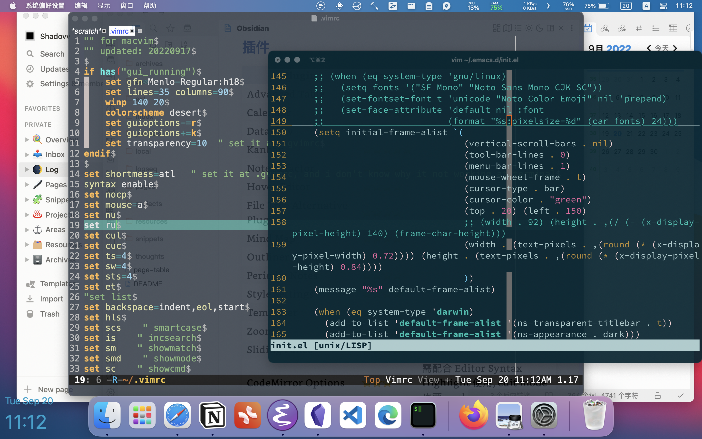
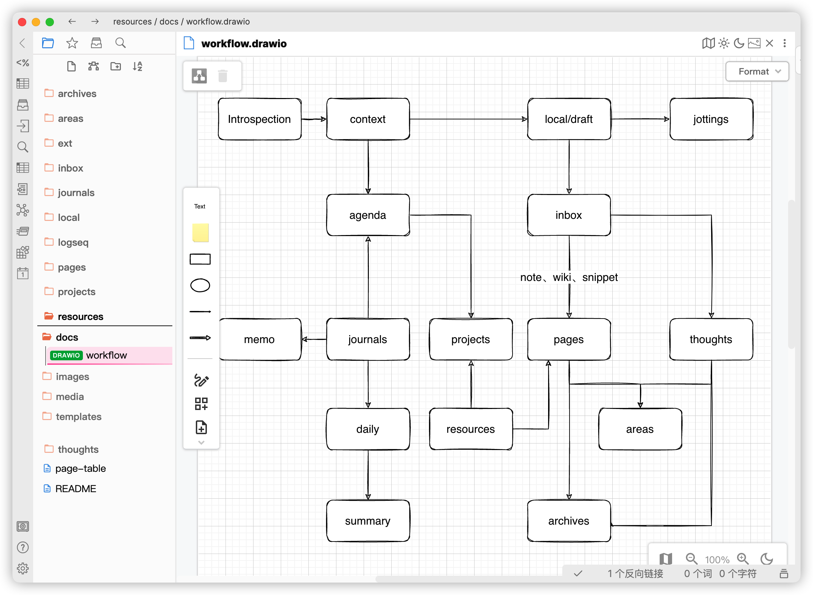

> 从备忘录、OneNote 到 Notion、Obsidian

## 内容分类
- Journal: 个人日常生活方面的一些记录, 包括饮食习惯、时间追踪、待办事项、备忘录、灵感动态、状态反思、阶段性总结等等
- Thought: 个人思想认知、观点态度的记录
- Note: 知识笔记, 包括学习笔记、片段摘录、wiki、cheatsheet 等
- 其他: 比如项目管理、记账、通讯录、书影音、Bookmarks、Reading list 等

> 总体上还是分这几个层级
> - journal、jot
> - thought
> - note、snippet
> - knowledge

## 目录组织

## 工具
- 推荐
    - Emacs/Vim/VSCode
    - [Obsidian](Obsidian/Obsidian.md)
    - [Notion](Notion/Notion.md)
    - 飞书
    - 滴答清单
    - 坚果云、GitHub
    - FreeFileSync (备份用)
    - Syncthing、FolderSync
    - XMind、知犀
    - draw.io、Excalidraw
    - Anki ?
- 观望?
    - Craft
    - FlowUs
    - Logseq
    - NocoDB
    - [AppFlowy](https://github.com/AppFlowy-IO/AppFlowy)
    - [AFFiNE](https://github.com/toeverything/AFFiNE)
- 不建议?
    - Typora
    - OneNote
    - ClickUp
    - 思源笔记
    - 语雀
    - RoamEdit

> [!info]+ 2022-09-20 目前主用 Notion、Obsidian
> 留着 Notion 一方面是目前 Obsidian 还有不足, 不适合 All-In, 另外 Notion 确实有一些杀手级功能无可替代.
> 
> Notion 的主要使用场景: 
> - 输入
>     - 碎片记录
>     - 时间管理
>     - 书签收藏
> - 排版、发布
>     - Column
>     - Database
> 
> Obsidian 的使用场景:
> - journal
> - page
>     - wiki
>     - note
>     - thought
> 

## Workflow

