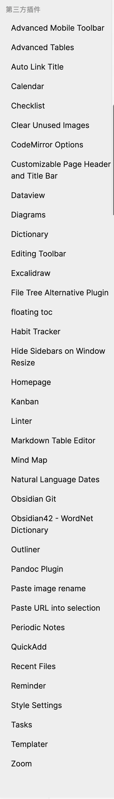

## 设置

- 编辑器
    - [ ] 缩减栏宽
    - [x] 严格换行
    - [ ] 显示 Front-matter
    - [x] 折叠标题、折叠缩进
    - [x] 自动补全
    - [x] 智能列表
    - [ ] 使用制表符
- 文件与链接
    - [ ] 确认删除提示
    - [x] 始终更新内部链接
    - [x] **新建笔记的存放位置: 当前文件所在的文件夹**
    - [x] **内部链接类型: ==相对路径==**
    - [ ] **使用 Wiki 链接** (使用上似乎不影响, 反倒是如果勾上的话图片之类的也会以这种形式?)
    - [x] 检测所有类型文件
    - [x] 附件默认存放路径: 指定的附件文件夹
- 关于
    - [ ] 自动更新
    - [ ] 切换配置文件夹 (建议准备一个精简配置供移动端使用)
- 核心插件
    - [x] 笔记重组
    - [x] 标签
    - [x] 出链
    - [x] 大纲
    - [x] 反链
    - [ ] 工作区
    - [x] 图谱
    - [x] 快速切换
    - [x] 命令面板
    - [ ] 模版
    - [ ] 日记
    - [x] 搜索
    - [x] ==**文件恢复**==
    - [x] 文件列表
    - [x] 斜杠命令
    - [x] 星标
    - [x] 页面预览
    - [x] 字数统计

## 快捷键

| 命令       | 快捷键        |
|:---------- |:------------- |
| 块链接     | 双中括号      |
| 块引用     | !双中括号     |
| 切换视图   | cmd + e       |
| 命令面板   | cmd + p       |
| 开关左右栏 | "ctrl +LR"    |
| 前进后退   | "cmd + []"    |
| 分栏       |               |
| 折叠       |               |
| 全屏       |               |
| 查找替换   | "cmd+H"       |
| 多点编辑   | alt + 鼠标    |
| 表格移动行 | "ctrl+cmd+↑↓" |
| 文件列表   |               |
| 快速切换   |               |
| Focus      | cmd+alt+z     | 

## 主题

- Blue Topaz: 绝对的首选!! (已经不是从前那个花里胡哨的了)
- Minimal: 功能上还可以, 但有些 bug？
- Things：不要和 minimal 的插件一起用！

## 插件

| Plugin                                 | Rating          | Remark                                                            |
|:-------------------------------------- |:--------------- |:----------------------------------------------------------------- |
| Checklist                              | ⭐️⭐️⭐️⭐️⭐️ |                                                                   |
| Linter                                 | ⭐️⭐️⭐️⭐️⭐️ |                                                                   |
| Kanban                                 | ⭐️⭐️⭐️⭐️⭐️ |                                                                   |
| cMenu                                  | ⭐️⭐️⭐️⭐️⭐️ | 建议用魔改版 Editing Toolbar                                      |
| Hover Editor                           | ⭐️⭐️⭐️⭐️⭐️ |                                                                   |
| Outliner                               | ⭐️⭐️⭐️⭐️⭐️ |                                                                   |
| Style Settings                         | ⭐️⭐️⭐️⭐️⭐️ |                                                                   |
| Advanced Table                         | ⭐️⭐️⭐️⭐️⭐️ |                                                                   |
| Calendar                               | ⭐️⭐️⭐️⭐️⭐️ |                                                                   |
| Dataview                               | ⭐️⭐️⭐️⭐️⭐️ |                                                                   |
| Markdown Table Editor                  | ⭐️⭐️⭐️⭐️⭐️ |                                                                   |
| Templater                              | ⭐️⭐️⭐️⭐️⭐️ |                                                                   |
| Tasks                                  | ⭐️⭐️⭐️⭐️⭐️ |                                                                   |
| File Tree Alternative Plugin           | ⭐️⭐️⭐️⭐️    | 非必需                                                            |
| Mind Map                               | ⭐️⭐️⭐️⭐️    |                                                                   |
| Periodic Notes                         | ⭐️⭐️⭐️⭐️    |                                                                   |
| Sliding Panes                          | ⭐️⭐️⭐️⭐️    |                                                                   |
| QuickAdd                               | ⭐️⭐️⭐️⭐️    | 非必需                                                            |
| BRAT                                   | ⭐️⭐️⭐️⭐️    | 安装未上架的插件                                                  |
| Recent Files                           | ⭐️⭐️⭐️       | 比较需要                                                          |
| Dictionary                             | ⭐️⭐️⭐️       |                                                                   |
| Zoom                                   | ⭐️⭐️⭐️       |                                                                   |
| Obsidian Git                           | ⭐️⭐️⭐️       | 注意备份!                                                         |
| Quick Explorer                         | ⭐️⭐️⭐️       |                                                                   |
| CodeMirror Options                     | ⭐️⭐️⭐️       | 需配合 Editor Syntax Highlight 使用, edit mode 也要 enable 才有效 |
| Obsidian Charts                        | ⭐️⭐️⭐️       |                                                                   |
| Reminder                               | ⭐️⭐️⭐️       |                                                                   |
| Paste URL into selection               | ⭐️⭐️⭐️       | 还有个 Auto Link Title 可能更好                                   |
| Hotkey Helper                          | ⭐️⭐️⭐️       |                                                                   |
| Excalidraw                             | ⭐️⭐️⭐️       | 还有个 Diagrams                                                   |
| Natural Language Dates                 | ⭐️⭐️⭐️       |                                                                   |
| Note Refactor                          | ⭐️⭐️⭐️       | 非必需                                                            |
| Customizable Page Header and Title Bar | ⭐️⭐️⭐️       |                                                                   |
| Buttons                                | ⭐️⭐️⭐️       | 非必需                                                            |
| Hide Sidebars on Window Resize         | ⭐️⭐️          | 还有个 Sidebar Expand On Hover                                    |
| Custom Frames                          | ⭐️⭐️          |                                                                   |
| Number Headings                        | ⭐️⭐️          | 自动编号有延迟                                                    |
| Shell commands                         | ⭐️⭐️          | 比如定义 git 和备份相关的命令. 注意不会触发链接更新               |
| Habit Tracker                          | ⭐️⭐️          | 还行                                                              |
| Clean Unused Images                    | ⭐️⭐️          |                                                                   |
| Paste image rename                     | ⭐️⭐️          |                                                                   |
| Focus Mode                             | ⭐️⭐️          |                                                                   |
| Tag Wrangler                           | ⭐️⭐️          | 个人比较少用到                                                    |
| DB Folder                              | ⭐️⭐️          | 现在基本能用了, 但还需观察一下                                    |
| Obsidian Image Toolkit                 | ⭐️⭐️          |                                                                   |
| Highlightr                             | ⭐️             | 右键不显示了? 貌似也不需要了 (有内置语法)                         |
| Wikilinks to MDLinks                   | ⭐️             |                                                                   |
| Homepage                               | ⭐️             |                                                                   |

其他 (没需求、待研究、观望)

- Advanced URI
- Annotator
- Creases
- Day Planner: 没必要吧
- Enhancing Mindmap
- Fantasy Calendar
- Flashcards
- *Floating TOC*
- Gallery
- Heatmap Calendar
- Image auto upload Plugin
- Juggl
- Local images
- MetaEdit
- Multi-Column Markdown: 好像有点麻烦
- Notion-Like Tables: 目前体验还很差
- Obsidian shared to Notion
- Obsidian Tabs: 印象中不太好用
- Org Mode
- Pandoc Plugin: 也就那样?
- Privacy Glasses: 多数时候用不上
- Quick Switcher++: 没必要吧
- Self-hosted LiveSync
- Smart Random Note: 没啥用
- Status Bar Pomodoro Timer
- TagFolder
- Text expand
- Timelines: 没整明白
- Tracker: 没整明白
- Vantage: 没必要

## Tips & Issues

- 尽量原子化
- 尽量不要有同名文件 (比如 Readme 这种)

## 参考

- [我的笔记工具和体系](../我的笔记工具和体系.md)
- [Obsidian VS Notion](../Obsidian%20VS%20Notion.md)
- [Obsidian 目录组织](Obsidian%20目录组织.md)
- Obsidian Table
- Obsidian GTD
- Obsidian Journal
- Obsidian Card
- Obsidian Booknote